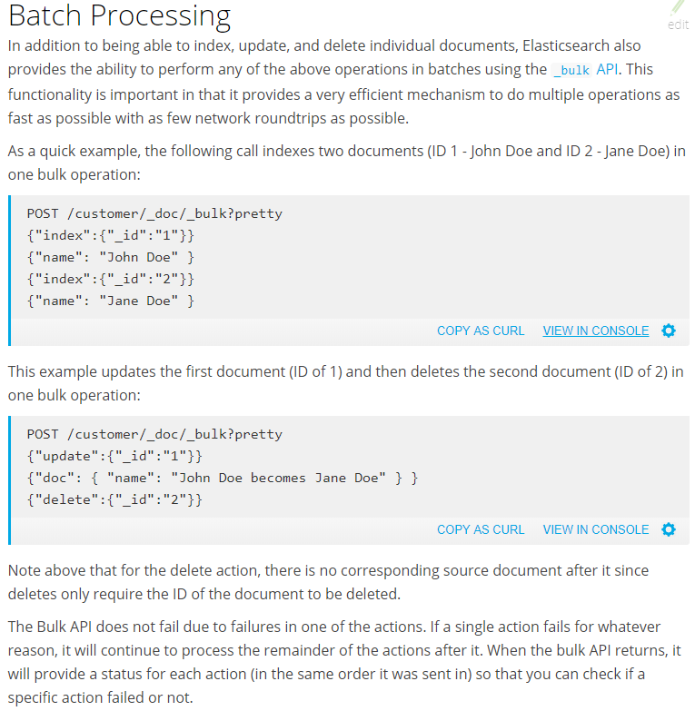

### function_score
```python
import requests

url = 'http://localhost:9200/'

r = requests.get(
    url=f'{url}avatar/_search?pretty',
    json={
        'query': {
            'function_score': {
                'query': {
                    'bool': {
                        'should': [
                            {'match': {'about': 'shoppIng'}},
                            {'match': {'interests': 'climing'}},
                        ]
                    }
                },
                'script_score': {
                    "script": {
                        "params": {
                            "idx": 3,
                        },
                        "source": '''
                            def idx=params.idx-1;
                            def start_score=0.5;
                            if(idx==2)
                                {start_score+=2;}
                            else
                                {start_score+=1;}
                            return start_score+Math.pow(doc['age'].value-doc['grade'].value,idx);
                        '''
                    }
                },
                "boost_mode": "replace",
                # only function score is used, the query score is ignored,other keys like multiply,sum,avg,max,min.
            }
        }
    }
)
print(r.text)  # 结果按照分数由高到低排序
```

### query and filter context
```python
import requests
url='http://localhost:9200/'

r=requests.get(   
    url=f'{url}avatar/_search?pretty',
    json={
        'query':{
            'bool':{
                'must':[     # query context
                    {'match':{'interests':'reading'}},  # The interests field contains the word reading.
                ],
                'must_not':[ # filter context,dont affect the score for matching documents.
                    {'match':{'about':'playing'}},
                ],
                'filter':[   # filter context
                    {'term':{'first_name':'xxoome'}},  # The first_name field contains the exact word xxoome.
                    {'range':{'age':{'gte':14,'lte':15}}},
                ],
            }
        }
    }
)
print(r.text)

r=requests.get(
    url=f'{url}avatar/_search?pretty',
    json={
        "query" : {
            'bool':{
                # 'must':[  # 相当于and,must_not表示既不包含,也不包含
                #     {'match':{'interests':'playing'}},
                #     {'match':{'about':'thanks'}}
                # ],
                'should':[  # 相当于or
                    {'match':{'interests':'playing'}},
                    {'match':{'first_name':'root'}}
                ],
            }
        },
        # '_source':['status','interests','about'],
    }
)
print(r.text)
"""
query context answers the question “How well does this document match this query clause?” also calculates a _score representing how well the document matches, relative to other documents.
filter context answers the question “Does this document match this query clause?” The answer is a simple Yes or No — no scores are calculated.
Filter context is mostly used for filtering structured data, e.g. Does this timestamp fall into the range 2015 to 2016? Is the status field set to "published"?
过滤器不会计算相关度得分,可以被缓存(LRU)到内存中,在重复搜索时,速度会比较快
"""

r=requests.get(
    url=f'{url}avatar/_search?pretty',
    json={
        "query" : {
            # "exists": {"field": "date"},
            # "match" : {"about" : "rock climbing"},  #全文搜索,查找包含rock或climbing的数据,_score越大说明匹配度越高,但对于long,date等未分词字段任然是精确匹配
            # "match_phrase" : {"about" : "rock climbing"},  # 短语搜索,查询包含"rock climbing"的员工记录,待查内容是个整体
            "range" : {"age" : {'gte':12,'lt':25}},  
        },
        '_source':['age','first_name','about'],
        "sort": [{ "_id": "desc" }],
        'track_scores':True,  # When sorting on a field, scores are not computed. By setting track_scores to true, scores will still be computed and tracked.
        'from':1,
        'size': 2,
    }
)
print(r.text)
# _shards – tells us how many shards were searched, as well as a count of the successful/failed searched shards
# hits.sort - sort key for results (missing if sorting by score)
# hits.total – total number of documents matching our search criteria
print(r.request.body)   # {"query": {"match": {"last_name": "Smith"}}},返回请求对应的data参数,post,put同样适用
```

### scroll
```python
import requests
url='http://localhost:9200/'

r = requests.get(
    url=f'{url}avatar/_search?scroll=10m',
    json={
        'size':1, # The size parameter allows you to configure the maximum number of hits to be returned with each batch of results
        'sort':['_doc'],  # Scroll requests have optimizations that make them faster when the sort order is _doc.
    }
) 
print(r.json()['hits']['hits'])
scroll_id = r.json()['_scroll_id']

while True:
    r=requests.get(  # GET or POST can be used.
        url=f'{url}_search/scroll', # URL不应该包含 the index name,this is specified in the original search request instead.
        json={
            'scroll':'1m',  # tells ES to keep the search context open for another 1m.同时可以使返回结果含有_scroll_id
            'scroll_id':scroll_id,
            }
    )  
    result = r.json()['hits']['hits']
    if not result:
        break
    print(result)
    scroll_id = r.json()['_scroll_id']

# Search context are automatically removed when the scroll timeout has been exceeded. However keeping scrolls open has a cost
# so scrolls should be explicitly cleared as soon as the scroll is not being used anymore
requests.delete(url=f'{url}_search/scroll',json={'scroll_id':scroll_id}) 

'''
The results that are returned from a scroll request reflect the state of the index at the time that the initial search request was made, like a snapshot in time.
Subsequent changes to documents (index, update or delete) will only affect later search requests.it is not recommended to use it for real time user requests.
the _scroll_id may change between requests, it doesn’t always change — in any case, only the most recently received _scroll_id should be used.
In order to use scrolling, the initial search request should specify the scroll parameter in the query string, which tells Elasticsearch how long it should keep the “search context” alive
The scroll parameter (passed to the search request and to every scroll request) tells Elasticsearch how long it should keep the search context alive. 
Its value (e.g. 1m, see Time unitsedit) does not need to be long enough to process all data — it just needs to be long enough to process the previous batch of results. 
Each scroll request (with the scroll parameter) sets a new expiry time. 
If a scroll request doesn’t pass in the scroll parameter, then the search context will be freed as part of that scroll request.
_doc has no real use-case besides being the most efficient sort order. So if you don’t care about the order in which documents are returned, then you should sort by _doc. This especially helps when scrolling.
scroll_id失效则会提示SearchContextMissingException: No search context found for id [34105534]
'''
```

### refresh
```python
"""
The Index, Update, Delete, and Bulk APIs support setting refresh to control when changes made by this request are made visible to search.
By default, the get API is realtime, and is not affected by the refresh rate of the index (when data will become visible for search).
If a document has been updated but is not yet refreshed, the get API will issue a refresh call in-place to make the document visible.
This will also make other documents changed since the last refresh visible. In order to disable realtime GET, one can set the realtime parameter to false.
在ES中写入和打开一个新段的轻量的过程叫做refresh,默认情况下每个分片会每秒自动刷新一次
这就是为什么我们说ES是近实时搜索:文档的变化并不是立即对搜索可见,但会在一秒之内变为可见
"""
import requests
url='http://localhost:9200/'
requests.post(f'{url}akatsuki/_doc/1?refresh',json={'xx':123})
print(requests.get(f'{url}akatsuki/_doc/1?pretty').text) # real-time
print(requests.get(f'{url}akatsuki/_search?pretty').text) # near real-time,如果post不含refresh参数,则search默认1s后才能感知到变化
```

### routing
```
By default,routing is controlled by using a hash of the document’s id value.
For more explicit control, the value fed into the hash function used by the router can be directly specified on a per-operation basis using the routing parameter. For example:
POST twitter/_doc?routing=kimchy
{
    "user" : "kimchy",
    "post_date" : "2009-11-15T14:12:12",
    "message" : "trying out Elasticsearch"
}
In the example above, the "_doc" document is routed to a shard based on the routing parameter provided: "kimchy".
_search会查询每个shard上面的文档,当指定routing时,只会在某个特定shard上查找文档(即使routing不正确,也可能找到文档,应为是根据routing的哈希取模计算的shard位置)
_id查找会根据_id哈希值取模,再到指定shard查找文档,当指定routing时会根据routing查找文档(建议创建时指定了routing的文档查找时也要指定routing,否则会有一定概率找不到)
同一个shard不能存在相同的_id,但不同shard之间可以存在相同的_id
```

### 基本信息
```python
import requests
url='http://localhost:9200/'
print(requests.get(f'{url}_cat').text)
'''
/_cat/allocation
各节点容量使用情况,requests.get(f'{url}_cat/allocation?v').text

/_cat/shards/{index}
shard & replica information

/_cat/nodes
结点列表,可以查看所有结点名

/_cat/indices/{index}
索引列表,pri means primary shards,rep means replica(the defaults)
health status index            uuid                     pri rep docs.count docs.deleted store.size pri.store.size
yellow open   megacorp         fsnGVVHBQXOWhEec7e6KNg   5   1   1          0            6.5kb      6.5kb
yellow open   avatar           PrcxFY_yRh6CGsQZnxTa2w   5   1   3          0            17.4kb     17.4kb

/_cat/segments/{index}
文档在shard上的分布情况

/_cat/count/{index}
所有/某个索引文档总数

/_cat/health
集群健康状态
Whenever we ask for the cluster health, we either get green, yellow, or red.
Green - everything is good (cluster is fully functional)
Yellow - all data is available but some replicas are not yet allocated (cluster is fully functional)
Red - some data is not available for whatever reason (cluster is partially functional)

/_cat/master
/_cat/tasks
/_cat/recovery/{index}
/_cat/pending_tasks
/_cat/aliases/{alias}
/_cat/thread_pool/{thread_pools}
/_cat/plugins
/_cat/fielddata/{fields}
/_cat/nodeattrs
/_cat/repositories
/_cat/snapshots/{repository}
/_cat/templates
'''

print(requests.get(f'{url}avatar/_settings?pretty').text) # 查看某个索引配置
print(requests.get(f'{url}_all/_settings?pretty').text) # 查看所有索引配置
print(requests.get(f'{url}avatar/_mapping?pretty').text)  # 常见类型包含text,long,date,boolean
print(requests.get(f'{url}xxoome/_stats?pretty').text)
```

### shard & replica
```
shard:
ES集群允许系统存储的数据量超过单机容量,实现这一目标引入分片策略shard,在一个索引index中document被分片处理到多个分片上
replica:
为了提升访问压力过大时单机无法处理所有请求的问题,ES集群引入了副本策略replica,对index中的每个分片创建冗余副本,查询时可以把这些副本当做主分片来对待,提供了高可用和数据安全的保障
It provides high availability in case a shard/node fails.
For this reason, it is important to note that a replica shard is never allocated on the same node as the original/primary shard that it was copied from.

The number of shards and replicas can be defined per index at the time the index is created. 
After the index is created, you may also change the number of replicas dynamically anytime. 
You can change the number of shards for an existing index using the _shrink and _split APIs, however this is not a trivial task and pre-planning for the correct number of shards is the optimal approach.
By default, each index in Elasticsearch is allocated 5 primary shards and 1 replica which means that if you have at least two nodes in your cluster, your index will have 5 primary shards and another 5 replica shards (1 complete replica) for a total of 10 shards per index.
```

### common
```
es配置文件名是elasticsearch.yml,日志文件会以天为单位自动打包成.gz文件
每个index只能对应一个type,后期版本会把type去掉
es用的乐观锁,请求带上version可用于并发控制
'''
You can use the version parameter to retrieve the document only if its current version is equal to the specified one.
This behavior is the same for all version types with the exception of version type FORCE which always retrieves the document.
Internally, Elasticsearch has marked the old document as deleted and added an entirely new document.
The old version of the document doesn’t disappear immediately, although you won’t be able to access it. Elasticsearch cleans up deleted documents in the background as you continue to index more data.
'''
Elasticsearch -> Indices   -> Types  -> Documents -> Fields
elasticsearch –d  #后台运行
bin/elasticsearch -d -p es_pid
kill `cat es_pid`
删除一个文档也不会立即从磁盘上移除,它只是被标记成已删除,ES将会在你之后添加更多索引的时候才会在后台进行删除
```

### 批量同步Mongodb数据到Elasticsearch
```python
from pymongo import MongoClient
from elasticsearch import Elasticsearch,helpers

OFFSET=100000
es_url='http://192.168.0.101:9200/'
mongo_url='mongodb://192.168.0.100:27017'
DB='amazon'
COLLECTION='galance'

if __name__ == '__main__':
    es = Elasticsearch(es_url)
    client = MongoClient(mongo_url)
    amazon=client[DB]
    actions=[]
    for data in amazon[COLLECTION].find():
        data.pop('url','')
        actions.append({
            "_index":COLLECTION,
            "_type":'_doc',
            "_id": data.pop('_id'),
            "_source": data,
        })
        if len(actions)==OFFSET:
            helpers.bulk(es,actions,request_timeout=180)
            actions[:]=[]
    if actions:
        helpers.bulk(es,actions,request_timeout=180) # request_timeout尽量长
```

### insert
```python
import requests
url='http://localhost:9200/'
r=requests.post(   # _version初始为1,每更新一次值自增1(查询操作不影响版本号),result只在第一次为created,再次执行则显示updated
    url=f'{url}megacorp/_doc/1',   # url/索引名/类型名/ID,id不存在是新增,存在是全量更新
    # url=f'{url}megacorp/_doc/1/_create',   # the index operation will fail if a document by that id already exists in the index.
    json={
        "first_name":"root",
        "last_name":"Smith",
        "age":13,
        "about":"hacker & climbing",
        "interests":'hacking'
    }
)
print(r.text)
r=requests.post(  # ES自动生成_id字段,每次操作都是创建过程
    url=f'{url}megacorp/_doc',
    json={
        "first_name":"avatar",
        "last_name":"xxoome",
        "age":21,
        "interests":'make love',
        "about":"I love to go rock climbing",
    }
)
print(r.text) # {"_index":"megacorp","_type":"employee","_id":"AVzKLzquG7MVWTajPjnN","_version":1,"result":"created","_shards":{"total":2,"successful":1,"failed":0},"created":true}
```

### partial update(部分更新,会自动执行乐观锁并发策略)
```python
import requests
url='http://localhost:9200/'
r=requests.post(
    url=f'{url}megacorp/_doc/3/_update',  # 如果文檔不存在则会出错
    json={
        'doc':{
            'first_name':'xxoo',
            'grade':10,
        },
    }
)
print(r.text)
# By default updates that don’t change anything detect that they don’t change anything and return "result": "noop" like this:
# {"_index":"megacorp","_type":"_doc","_id":"3","_version":4,"result":"noop","_shards":{"total":0,"successful":0,"failed":0}}

r=requests.post(
    url=f'{url}megacorp/_doc/3/_update',
    json={
        'script':'ctx._source.counter+=2',
        "upsert" : {"counter" : 1},
        # "script" : "ctx._source.remove('new_field')", # remove a field from the document  
    }
)

# If the document does not already exist, the contents of the upsert element will be inserted as a new document. 
# If the document does exist, then the script will be executed instead.
# If both doc and script are specified, then doc is ignored. Best is to put your field pairs of the partial document in the script itself.
```

### delete
```python
import requests
url='http://localhost:9200/'

requests.delete(f'{url}megacorp')  # 删除整个数据库
requests.delete(f'{url}megacorp/_doc/2')  # 删除文档,不管found是true or false,_version的值都会增加,应为产生了一条记录
r=requests.head(f'{url}megacorp/_doc/2')  # head请求不会返回响应体,通过状态码检查文档是否存在(200/404)，虽然get也能通过状态码来判断,但更耗资源
print(r.text,r.status_code)

r=requests.post(
    url=f'{url}megacorp/_delete_by_query',  # 按条件删除,只能是post
    json={
        "query": {
            "term": { "first_name": "xxoome" }
        }
    }
)
print(r.text)
```

### select & _mget
```python
import requests

url = 'http://localhost:9200/'

print(requests.get(f'{url}megacorp/_doc/1?_source=first_name,last_name,age').json())  # _source用于限定返回字段
print(requests.get(f'{url}megacorp/_doc/1/_source').json())
print(requests.get(f'{url}megacorp,kimchy/_search?from=10&size=5').json())  # 搜索全部员工中的limit(10,5),默认情况下返回前10个结果
print(requests.get(f'{url}megacorp/_search?q=last_name:toor').json())  # 搜索姓氏中包含toor的员工,可以用_all代替具体索引,意思是所有索引
print(requests.get(f'{url}megacorp/_doc/_count?q=last_name:toor').json())

r = requests.get(
    url=f'{url}/_mget?pretty',  # 也可以在url处写index和type
    json={
        "docs": [
            {
                "_index": "megacorp",
                "_type": "_doc",
                "routing": "xxoome",
                "_source": ["grade", "first_name"],
                "_id": "3"
            },
            {
                "_index": "megacorp",
                "_type": "_doc",
                "_id": "2"
            }
        ]
    }
)
print(r.text)

requests.get(
    url=f'{url}megacorp/_doc/_mget?pretty',
    json={
        "ids": ["3", "2"]
    }
)
```

### term query
```
The term query finds documents that contain the exact term specified in the inverted index.
A boost parameter can be specified to give this term query a higher relevance score than another query
GET _search
{
  "query": {
    "bool": {
      "should": [
        {
          "term": {
            "status": {
              "value": "urgent",
              "boost": 2.0   # The urgent query clause has a boost of 2.0, meaning it is twice as important as the query clause for normal.
            }
          }
        },
        {
          "term": {
            "status": "normal" # The normal clause has the default neutral boost of 1.0.
          }
        }
      ]
    }
  }
}

Why doesn’t the term query match my document?
String fields can be of type text (treated as full text, like the body of an email), or keyword (treated as exact values, like an email address or a zip code).
Exact values (like numbers, dates, and keywords) have the exact value specified in the field added to the inverted index in order to make them searchable.
However, text fields are analyzed. This means that their values are first passed through an analyzer to produce a list of terms, which are then added to the inverted index.
There are many ways to analyze text: the default standard analyzer drops most punctuation, breaks up text into individual words, and lower cases them.
For instance, the standard analyzer would turn the string “Quick Brown Fox!” into the terms [quick, brown, fox].
This analysis process makes it possible to search for individual words within a big block of full text.
The term query looks for the exact term in the field’s inverted index — it doesn’t know anything about the field's analyzer. 
This makes it useful for looking up values in keyword fields, or in numeric or date fields.
When querying full text fields, use the match query instead, which understands how the field has been analyzed.
To demonstrate, try out the example below. First, create an index, specifying the field mappings, and index a document:
PUT my_index
{
  "mappings": {
    "_doc": {
      "properties": {
        "full_text": {
          "type":  "text"     # The full_text field is of type text and will be analyzed.
        },
        "exact_value": {
          "type":  "keyword"  # The exact_value field is of type keyword and will NOT be analyzed.
        }
      }
    }
  }
}

PUT my_index/_doc/1
{
  "full_text":   "Quick Foxes!",   # The full_text inverted index will contain the terms: [quick, foxes].
  "exact_value": "Quick Foxes!"    # The exact_value inverted index will contain the exact term: [Quick Foxes!].
}


Now, compare the results for the term query and the match query:
GET my_index/_search
{
  "query": {
    "term": {
      "exact_value": "Quick Foxes!"  # This query matches because the exact_value field contains the exact term Quick Foxes!.
    }
  }
}

GET my_index/_search
{
  "query": {
    "term": {
      "full_text": "Quick Foxes!"  # This query does not match, because the full_text field only contains the terms quick and foxes. It does not contain the exact term Quick Foxes!.
    }
  }
}

GET my_index/_search
{
  "query": {
    "term": {
      "full_text": "foxes"  # A term query for the term foxes matches the full_text field.
    }
    # "terms": {"full_text": ["quick","foxes"]}  # 相当于in操作
  }
}

GET my_index/_search
{
  "query": {
    "match": {
      "full_text": "Quick Foxes!"  # This match query on the full_text field first analyzes the query string, then looks for documents containing quick or foxes or both.
    }
  }
}
```

### bulk

