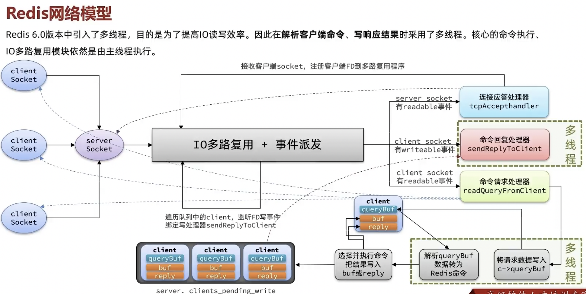

### generic

```
OBJECT IDLETIME key: 返回自上次访问key以来的时间(单位秒),仅当maxmemory-policy设置为LFU策略之一时该命令才可用
OBJECT FREQ key: 返回key的对数访问频率计数器,仅当maxmemory-policy设置为LFU策略之一时该命令才可用
OBJECT ENCODING key: 返回key对象的内部编码
string: 64位有符号整数为int编码,44个字节以内(object head与sds是一段连续空间,只需申请一次内存,效率更高)为embstr编码,其余为raw编码
list: listpack编码
set: 集合较小(参考配置文件)时为intset或者listpack编码,集合较大时为hashtable编码
zset: 集合较小(参考配置文件)时为listpack编码,score-member存储为2个相邻的entry,集合较大时为skiplist编码(隐含了hashtable编码)
hash: 集合较小(参考配置文件)时为listpack编码,field-value存储为2个相邻的entry,集合较大时为hashtable编码

debug sleep 1: 模拟耗时操作,很有用
type key: 返回key类型 (eg:string, list, set, zset, hash and stream)
randomkey: 返回随机key
ttl key: 返回key剩余的过期时间秒数(不过期的key返回-1,不存在的key返回-2)
rename key newkey: 如果newkey已存在,则newkey的原值和过期时间被覆盖,当发生这种情况时会执行隐式del操作,集群模式下新旧key必须位于同一哈希槽中
del key [key ...]: 当key包含字符串以外的值时,该键的单独复杂度为O(M),其中M是列表、集合、排序集合或哈希中的元素数量
unlink key [key ...]: 在不同的线程中执行O(N)操作删除指定的key以回收内存,它不会阻塞,而del会阻塞
exists key [key ...]: 判断key是否存在, 返回1/0
persist key: 把key置为永久有效
expiretime key: 返回给定key到期的绝对Unix时间戳(以秒为单位)
expireat key unix-time-seconds [NX | XX | GT | LT]

expire key seconds [NX | XX | GT | LT],所有涉及更新key值的操作不会影响原本的过期时间,set命令是替换新建
密钥过期信息存储为绝对Unix时间戳,这意味着即使Redis实例不活动,时间也在流动,为了使过期功能正常工作,计算机时间必须保持稳定
即使正在运行的实例也会始终检查计算机时钟,如果您将key生存时间设置为1000秒,然后将计算机时间设置为未来2000秒,则该key将立即过期
key过期机制如下
key被动过期: 当某个客户端尝试访问它时,发现key过期就删除(具体实现是expireIfNeeded)
key主动过期: 定期(每秒10次,由配置变量hz控制)在设置了过期时间的key中随机测试一些(20个)键,所有已过期的key都将被删除,如果超过1/4的key已过期,再重新开始
内存淘汰机制: 由配置变量maxmemory-policy控制,常用策略allkeys-lru、volatile-lru等

keys pattern: 查找所有符合给定模式pattern的key,生产环境慎用,可考虑使用SCAN或集合
*:通配任意多个字符  ?:通配单个字符  []:通配括号内的某1个字符
127.0.0.1:6379> keys *
(empty list or set)
127.0.0.1:6379> mset one 1 two 2 three 3 four 4
OK
127.0.0.1:6379> keys o*
1) "one"
127.0.0.1:6379> keys ???
1) "one"
2) "two"
127.0.0.1:6379> keys on[dce]
1) "one"

scan cursor [MATCH pattern] [COUNT count] [TYPE type]: 遍历所有键,类似的还有sscan,hscan,zscan
游标从0开始,到0遍历结束,count只是个hint,返回的结果可多可少
遍历过程中如果有数据修改,改动后的数据能不能遍历到是不确定的,返回的结果可能会有重复
scan 0 match premissions:* count 100  

sort key [BY pattern] [LIMIT offset count] [GET pattern [GET pattern ...]] [ASC | DESC] [ALPHA] [STORE destination]
返回或保存给定列表、集合、有序集合key中经过排序的元素,只能根据一个字段排序(无法实现类似order by name,score功能),无法在集群下运行
排序默认以数字作为对象,值被解释为双精度浮点数,当需要对字符串进行排序时,需要显式地添加alpha修饰符
有序集合是根据member而非score排序
lpush rank 1 3 2 5 4
sort rank desc limit 1 3
1) "4"
2) "3"
3) "2"
zadd alphabet 10 a 20 c 0 b -10 e 30 d
sort alphabet alpha
1) "a"
2) "b"
3) "c"
4) "d"
5) "e"
lpush uid 1 2 3 4 0 5
hmset user_info_1 name admin level 9999
hmset user_info_2 name jack level 10
hmset user_info_3 name peter level 25
hmset user_info_4 name mary level 70
通过by可以让uid按其他键的元素来排序,不在user_level_*下面的uid默认比其他uid要小,且也会按指定顺序排序
sort uid by user_info_*->level
1) "0"
2) "5"
3) "2"
4) "3"
5) "4"
6) "1"
get #获取元素本身(被排序键的值),类似与sorted-set withscores
sort uid get # get user_info_*->name get user_info_*->level 
 1) "0"
 2) (nil)
 3) (nil)
 4) "1"
 5) "admin"
 6) "9999"
 7) "2"
 8) "jack"
 9) "10"
10) "3"
11) "peter"
12) "25"
13) "4"
14) "mary"
15) "70"
16) "5"
17) (nil)
18) (nil)
通过给store指定一个key,返回排序结果的元素个数,并将排序结果保存到给定key上,key类型是list
如果被指定key已存在,那么原有的值将被排序结果覆盖
sort uid by user_info_*->level store result
(integer) 6
lrange result 0 -1
1) "0"
2) "5"
3) "2"
4) "3"
5) "4"
6) "1"
通过将一个不存在的键作为参数传给by选项,可以跳过排序
通过将这种用法和GET选项配合,就可以在不排序的情况下获取多个外部键,类似于SQL的join
sort uid by not-exists-key get user_info_*->level get user_info_*->name
 1) (nil)
 2) (nil)
 3) (nil)
 4) (nil)
 5) "70"
 6) "mary"
 7) "25"
 8) "peter"
 9) "10"
10) "jack"
11) "9999"
12) "admin"
```

### connection

```
ping #测试服务器是否可用
select 0|1|2...: 从0到15编号,可从配置文件修改,所有数据库保留在同一个RDB/AOF文件中,集群无法使用
实际项目中数据库应该用于分隔属于同一应用的不同键,而不是为多个不相关的应用使用单个Redis实例
client id:  返回当前连接的ID,不重复且单调递增,ID大说明后来新建的连接
client info:  返回有关当前客户端连接服务器的信息和统计信息
client list [id client-id [client-id ...]]: 返回有关所有客户端连接服务器的信息和统计信息
client kill: 杀死某个连接 client kill addr 127.0.0.1:43501
```

> ### client info参数解读

- id: a unique 64-bit client ID
- addr: address/port of the client
- laddr: address/port of local address client connected to (bind address)
- fd: file descriptor corresponding to the socket
- name: the name set by the client with CLIENT SETNAME
- age: total duration of the connection in seconds
- idle: idle time of the connection in seconds
- flags: client flags (see below)
- db: current database ID
- sub: number of channel subscriptions
- psub: number of pattern matching subscriptions
- ssub: number of shard channel subscriptions. Added in Redis 7.0.3
- multi: number of commands in a MULTI/EXEC context
- qbuf: query buffer length (0 means no query pending)
- qbuf-free: free space of the query buffer (0 means the buffer is full)
- argv-mem: incomplete arguments for the next command (already extracted from query buffer)
- multi-mem: memory is used up by buffered multi commands. Added in Redis 7.0
- obl: output buffer length
- oll: output list length (replies are queued in this list when the buffer is full)
- omem: output buffer memory usage
- tot-mem: total memory consumed by this client in its various buffers
- events: file descriptor events (see below)
- cmd: last command played
- user: the authenticated username of the client
- redir: client id of current client tracking redirection
- resp: client RESP protocol version. Added in Redis 7.0

### server management

```
REPLICAOF host port: 做host port的从服务器(数据清空,复制新主内容),一个master可以有多个slave,master挂掉后slave会升级为master
默认情况下副本将忽略最大内存,这意味着key的驱逐将由主服务器处理,将DEL命令发送到副本作为主服务器端驱逐的key,此行为可确保主从保持一致
REPLICAOF no one:变成主服务器(原数据不丢失,一般用于主服失败后)

ACL LIST: 显示服务器中活跃的ACL规则,每一行有一个不同的用户
ACL CAT [category]: 如果不带参数将显示可用的ACL类别,如果给出类别将显示指定类别中所有Redis命令
ACL DELUSER username [username ...]: 删除所有指定的ACL用户,并终止所有通过该用户认证的连接
ACL SETUSER username [rule [rule ...]]: 修改现有用户/创建新用户规则,如果用户已存在,新规则将被合并到旧规则
ACL GETUSER username: 返回为现有ACL用户定义的所有规则

bgrewriteaof 手动触发AOF重写,Redis也会自动触发
bgsave 后台开启子进程dump数据到RDB文件
shutdown [nosave | save]: 关闭服务器,保存数据(If persistence is enabled),修改AOF(如果设置),NOSAVE会阻止DB保存操作
flushdb: 清空当前数据库的所有数据
flushall: 清空所有数据库数据

config get parameter [parameter ...]: 读取正在运行的服务器的配置参数,支持通配符
CONFIG SET parameter value [parameter value ...]: 在运行时重新配置服务器,并在下一条命令执行时生效
config rewrite: 重写服务器启动时使用的redis.conf文件,即更新CONFIG SET命令

dbsize: 当前数据库未过期key的数量
INFO: 返回服务器统计信息,可以查看主从,内存/CPU使用,持久化,每个库使用情况/配置文件位置
monitor: 显示redis处理的每个命令,运行单个MONITOR客户端可能会导致吞吐量降低50%以上,集群下该命令只会监控指定ip:port的redis实例

SLOWLOG GET [count]: 获取慢查询日志,慢日志记录超过指定执行时间的查询,可选的count限制返回条目数量,-1表示返回所有条目
SLOWLOG RESET: 清空慢日志
LATENCY DOCTOR: 报告不同的延迟相关问题,并提供可能的补救措施
LATENCY LATEST: 报告记录的最新延迟事件

MEMORY DOCTOR: 报告服务器遇到的不同内存相关问题,并建议可能的补救措施
MEMORY USAGE key [SAMPLES count]: 时间复杂度O(N),N是样本个数,报告键及其值需要存储在RAM中的字节数
对于嵌套数据类型,可以提供可选的SAMPLES count选项,指定采样值数量,默认是5,SAMPLES 0对所有嵌套值进行采样
127.0.0.1:6379> hlen hkey   // hkey有100w个字段,每个字段value长度介于1~1024字节
(integer) 1000000
127.0.0.1:6379> MEMORY usage hkey  //默认SAMPLES为5
(integer) 521588753
127.0.0.1:6379> MEMORY usage hkey SAMPLES 100  //指定SAMPLES为100
(integer) 617977753
```

### bitmap

```
bitop and|or|xor|not destkey key1 [key2 ...]: 对key1,key2..keyN位运算,结果存到destkey
bitpos key bit [start [end]]: 返回字符串第一个设置为1或0的位置,范围参考getrange,默认单位是字节
bitcount key [start end]: 统计1的个数,范围参考getrange
getbit key offset: 获取值的二进制表示对应位上的值,offset从0编号,最大值2^32-1,so key最大为512M(由proto-max-bulk-len配置决定)
setbit key offset 0|1: 设置offset对应二进制位上的值,返回该位上的旧值
当需要多次调用setbit完成初始化时,可以使用set来设置整个位图
位图不是实际的数据类型,而是在string类型上定义的一组面向位的操作,这意味着位图可以与字符串命令一起使用
127.0.0.1:6379> setbit lower 2 1
(integer) 0
127.0.0.1:6379> get lower
" "
127.0.0.1:6379> set char Q
OK
127.0.0.1:6379> bitop or char char lower
(integer) 1
127.0.0.1:6379> get char
"q"
```

### geospatial

```
geoadd key [NX | XX] [CH] longitude latitude member [longitude latitude member ...]
时间复杂度: O(log(N)) for each item added, 其中N是zset中的元素数量,数据存储在有序集合,score对应geohash的值
geohash值的前缀相同的位数越多,代表的位置越接近,反之不成立,位置接近的geoHash值不一定相似

geohash key [member [member ...]]: 返回一个包含指定元素位置的11个字符数组
geodist key member1 member2 [M | KM | FT | MI]
geopos key [member [member ...]]: 返回指定成员的经度、纬度

geosearch key <FROMMEMBER member | FROMLONLAT longitude latitude> 
<BYRADIUS radius <M | KM | FT | MI> | BYBOX width height <M | KM | FT | MI>> 
[ASC | DESC] [COUNT count [ANY]] [WITHCOORD] [WITHDIST] [WITHHASH]
Time complexity:O(N+log(M)) where N is the number of elements in the grid-aligned bounding box area 
around the shape provided as the filter and M is the number of items inside the shape
默认情况下匹配项返回时未排序,使用ANY选项时,一旦找到足够的匹配项就返回,这意味着结果可能不是最接近指定点的结果,但速度会快很多
```

### hash(字典)

```
hset key field value [field value ...]: 如果有field,则覆盖原field域的值
hsetnx key field value
hlen key: 返回key中元素的数量,时间复杂度O(1)
hkeys key: 返回key中所有的field,时间复杂度O(N)
hvals key: 返回key中所有的value
hexists key field: 判断key中有没有field域,时间复杂度O(1)
hdel key field [field ...]
hgetall key: 返回key中所有得field-value
hmget key field [field ...]
hincrbyfloat key field increment
hstrlen key field: 返回key中的field关联的值的字符串长度
```

### hyperloglog

```shell
pfcount key [key ...]: 当使用单个key时,时间复杂度O(1),用12k(加上键本身的几个字节)内存来计算集合中唯一元素个数,标准误差为0.81%
当使用多个key时,在内部将存储在key处的数据结构合并到临时HyperLogLog中,返回并集,比较慢慎用
HyperLogLog使用双重表示法来表示:稀疏表示法适用于计算少量元素的HLL,而密集表示法适用于较高基数,当需要时Redis会自动从稀疏表示切换到稠密表示
存储结构是字符串,可以使用GET检索并使用SET恢复
127.0.0.1:6379> pfadd hll a b c d a      
(integer) 1       # 1 if at least 1 HyperLogLog internal register was altered. 0 otherwise.
127.0.0.1:6379> pfcount hll
(integer) 4
```

### list(可以快速访问尾部,每个元素变长的数组)

```
llen key: 计算key元素个数,时间复杂度O(1)
lindex key index: 返回index位置上的值,时间复杂度O(N),N是要遍历以到达索引处的元素的元素数,查询列表第一个或最后一个元素的时间复杂度为O(1)
ltrim key start stop: 使列表只存储[start,stop]范围内的数据,支持负索引,时间复杂度O(N),N是操作要删除的元素数量
lset key index element: 时间复杂度O(N),N是list长度
lrange key start stop: 返回list中[start, stop]中的元素,左数从0开始,右数从-1开始
lrem key count element: 从列表里移除前count次出现的值为element的元素(count>0从头往尾,count<0从尾往头,count=0移除所有)
lmove source destination <LEFT | RIGHT> <LEFT | RIGHT>: 原子地返回并删除源中第一/最后个元素,并将该元素存到目标列表第一/最后个元素
blmove source destination <LEFT | RIGHT> <LEFT | RIGHT> timeout: lmove阻塞版

lpush key element [element ...]: 把值按顺意一个个插入到list头部,类似还有rpush
lpop key [count]: 从list头部按顺序一个个弹出count个元素,类似还有rpop
blpop key [key ...] timeout: 类似还有brpop
lpop阻塞版,超时为零可无限阻塞,当没有元素可以从给定列表弹出时,会阻塞连接直到超时或发现可弹出元素
当给定多个key参数时,按key的先后顺序依次检查各个列表,弹出第一个非空列表的名字和头元素
相同的key可以被多个客户端同时阻塞,不同的客户端被放进一个队列中,按先阻塞先服务(first-BLPOP,first-served)顺序为客户端执行BLPOP命令
如果list在同一时刻接收到多个元素(LPUSH,MULTI块,Lua脚本),会等元素接受完再执行blpop,下面Client B会接受c
Client A: BLPOP foo 0
Client B: LPUSH foo a b c
可与管道一起使用,但这种设置仅在它是管道的最后一个命令时才有意义,在MULTI/EXEC块内使用阻塞命令没有意义,行为表现为对应的非阻塞版命令

lmpop numkeys key [key ...] <LEFT | RIGHT> [COUNT count]: 从key列表中的第一个非空列表键中弹出一个或多个元素
blmpop timeout numkeys key [key ...] <LEFT | RIGHT> [COUNT count]: lmpop阻塞版
redis> LPUSH mylist "1" "2" "3"
(integer) 3
redis> LPUSH mylist2 "a" "b" "c" "d" "e"
(integer) 5
redis> LMPOP 2 mylist mylist2 right count 4
1) "mylist"
2) 1) "1"
   2) "2"
   3) "3"
redis> LRANGE mylist 0 -1
(empty array)
redis> LMPOP 2 mylist mylist2 right count 2
1) "mylist2"
2) 1) "a"
   2) "b"
```

### 发布订阅(建议使用redis stream代替)

```
subscribe channel [channel ...]: 客户端订阅指定频道
psubscribe pattern [pattern ...]: 客户端订阅给定的模式,匹配规则同keys
subscribe foo
psubscribe f*
if a message is sent to channel foo, the client will receive two messages: one of type message and one of type pmessage.

unsubscribe [channel [channel ...]]: 取消客户端对给定频道的订阅,如果没有给定频道则取消订阅所有频道
punsubscribe [pattern [pattern ...]]: 参考unsubscribe

publish channel message: 将消息发布到给定频道,时间复杂度O(N+M),N是订阅接收通道的客户端数量,M是订阅模式的任何客户端总数
在集群中可以发布到每个节点,因此客户端可以通过连接任何一个节点来订阅任何频道,返回收到消息的客户端数量,在集群中只统计同一节点接收的客户端数量

pubsub numpat: 返回所有客户端PSUBSCRIBE订阅的唯一模式的总数(不是订阅模式的客户端计数)
pubsub channels [pattern]: 列出当前活跃频道,活跃频道是具有一个或多个订阅者(不包括订阅模式的客户端)的通道
如果未指定模式,则列出所有通道,如果指定模式,则仅列出与指定模式匹配的通道
消息将被传递一次,如果订阅者无法处理消息(如错误或网络断开),则消息将永远丢失,不支持数据持久化
pubsub numsub [channel [channel ...]]: 返回指定通道的订阅者数量(不包括订阅模式的客户端)
```

> ### 发布订阅代码示例

```python
from redis import Redis

r = Redis()
p = r.pubsub()
p.subscribe('my-first-channel')
p.psubscribe('my-*')
r.publish('my-first-channel', 'some data')
print(p.get_message())
print(p.get_message())
print(p.get_message())
print(p.get_message())
print(p.get_message())
r.publish('my-first-channel', 'some data')
print(p.get_message())
print(p.get_message())
print(p.get_message())
'''
With [un]subscribe messages, this value will be the number of channels and patterns the connection is currently subscribed to.
With [p]message messages, this value will be the actual published message.
{'type': 'subscribe', 'pattern': None, 'channel': b'my-first-channel', 'data': 1}
{'type': 'psubscribe', 'pattern': None, 'channel': b'my-*', 'data': 2}
{'type': 'message', 'pattern': None, 'channel': b'my-first-channel', 'data': b'some data'}
{'type': 'pmessage', 'pattern': b'my-*', 'channel': b'my-first-channel', 'data': b'some data'}
None
{'type': 'message', 'pattern': None, 'channel': b'my-first-channel', 'data': b'some data'}
{'type': 'pmessage', 'pattern': b'my-*', 'channel': b'my-first-channel', 'data': b'some data'}
None
'''
```

### scripting and functions

```
script flush [ASYNC | SYNC]: 清空所有脚本缓存,redis重启or关闭也会触发该命令
script load script: 将脚本加载到脚本缓存中,但不执行,返回脚本的SHA1摘要(sha1(b'lua script').hexdigest())
evalsha sha1 numkeys [key [key ...]] [arg [arg ...]]: 与eval相似,前提是sha1已被注册
eval script numkeys [key [key ...]] [arg [arg ...]]: 脚本以原子方式执行,类似于MULTI/EXEC,返回脚本的值,并注册脚本的sha值到redis
为了确保脚本正确执行,脚本访问的所有keys都必须显式提供为输入键参数,而不应访问具有以编程方式生成的key

FUNCTION DELETE library-name: 删除库及其所有函数
FUNCTION LOAD [REPLACE] function-code: 加载库,当名称已存在时会报错,REPLACE修饰符更改此行为并覆盖现有库,不同库的函数名不能相同
函数与数据一起存储,也被持久化到AOF文件并从master复制到replicas
FUNCTION DUMP: 返回已加载库的序列化
FUNCTION RESTORE serialized-value [FLUSH | APPEND | REPLACE]: dump逆操作,从序列化中恢复库
FUNCTION FLUSH [ASYNC | SYNC]: 删除所有库
FUNCTION LIST [LIBRARYNAME library-name-pattern] [WITHCODE]: 返回有关函数和库的信息
FUNCTION STATS: 返回正在运行的函数信息以及可用执行引擎的信息
FCALL function numkeys [key [key ...]] [arg [arg ...]]: 原子调用函数,参数参考eval,所有key/arg作为回调函数的第一/二个参数(table类型)
```

> ### function代码示例

```lua
#!lua name=mylib

local function check_keys(keys)
  local error = nil
  local nkeys = table.getn(keys)
  if nkeys == 0 then
    error = 'Hash key name not provided'
  elseif nkeys > 1 then
    error = 'Only one key name is allowed'
  end
  if error ~= nil then
    redis.log(redis.LOG_WARNING, error);
    return redis.error_reply(error)
  end
  return nil
end

local function my_hset(keys, args)
  local error = check_keys(keys)
  if error ~= nil then
    return error
  end

  local hash = keys[1]
  local time = redis.call('TIME')[1]
  return redis.call('HSET', hash, '_last_modified_', time, unpack(args))
end

local function my_hgetall(keys, args)
  local error = check_keys(keys)
  if error ~= nil then
    return error
  end

  redis.setresp(3)
  local hash = keys[1]
  local res = redis.call('HGETALL', hash)
  res['map']['_last_modified_'] = nil
  return res
end

local function my_hlastmodified(keys, args)
  local error = check_keys(keys)
  if error ~= nil then
    return error
  end

  local hash = keys[1]
  return redis.call('HGET', keys[1], '_last_modified_')
end

redis.register_function('my_hset', my_hset)
redis.register_function('my_hgetall', my_hgetall)
redis.register_function('my_hlastmodified', my_hlastmodified)

# 将上述代码保存为mycode.lua,然后cat mylib.lua | redis-cli -x FUNCTION LOAD
# redis> FCALL my_hset 1 myhash myfield "some value" another_field "another value"
# (integer) 3
# redis> FCALL my_hgetall 1 myhash
# 1) "myfield"
# 2) "some value"
# 3) "another_field"
# 4) "another value"
# redis> FCALL my_hlastmodified 1 myhash
# "1640772721"
# 127.0.0.1:6379> FCALL my_hset 0 myhash nope nope
# (error) Hash key name not provided
# 127.0.0.1:6379> FCALL my_hgetall 2 myhash anotherone
# (error) Only one key name is allowed
# 其中keys=[myhash], args=[myfield "some value" another_field "another value"]
```

### set(唯一性,无序性)

```
SINTER key [key ...]: 返回所有集合的交集(公共部分),单个key等价于smembers,存储版为SINTERSTORE destination key [key ...]
SUNION key [key ...]: 返回所有集合的并集,单个key等价于smembers,存储版为SUNIONSTORE destination key [key ...]
SDIFF key [key ...]: 返回第一个集合和其他集合的差集,单个key等价于smembers,存储版为SDIFFSTORE destination key [key ...]
SADD key member [member ...]: 往集合key中增加元素
scard key: 返回集合中元素的个数
SMISMEMBER key member [member ...]: 判断member是否在集合中
SREM key member [member ...]: 从集合中删除指定成员,返回实际删除的元素个数
SPOP key [count]: 从集合中删除并返回一个或多个随机成员
SRANDMEMBER key [count]: 返回集合中随机的一个或多个不同元素,如果count<0,允许多次返回相同元素且顺序随机,当n大于集合元素总数时顺序不再随机
SMOVE source destination member: 原子操作,把source中的member删除,并添加到destination集合中
```

### sorted set(有序集合,唯一性)

```
ZADD key [NX | XX] [GT | LT] score member [score member...]: 时间复杂度O(log(N)),N是排序集中的元素数量
将指定分数的成员添加到有序集合中,使用双64位浮点数表示分数,如果添加的成员已经存在于有序集合中,则会更新成员的score
集合按分数由小到大排序,分数相同按member字典序排序,个别情况下需要按member排序这种场景
XX: 只更新已经存在的元素,不添加新元素
NX:仅添加新元素,不更新已经存在的元素
LT: 如果新分数小于当前分数,则仅更新现有元素,该标志不会阻止添加新元素
ZINCRBY key increment member: 如果member不在有序集合,先创建score=0的member,如果key不存在,先创建一个只带有member的有序集合
zcard key: 返回元素个数
ZREM key member [member ...]: 删除集合中的元素
ZREMRANGEBYRANK key start stop: 删除名次在[start,end]之间的元素
ZREMRANGEBYSCORE key min max: 删除score在[min,max]之间的元素
ZRANK key member [WITHSCORE]: 返回从低到高有序集中成员的排名,排名从0开始,逆序版ZREVRANK key member [WITHSCORE],复杂度O(log(N))
ZSCORE key member: 返回元素的分数,复杂度O(1),multi版本ZMSCORE key member [member ...]
ZCOUNT key min max: 返回[min,max]区间内元素的数量,复杂度仅为O(log(N)),因为它使用ZRANK来获取范围
ZINTER| ZINTERSTORE| ZUNION| ZUNIONSTORE| ZDIFF| ZDIFFSTORE: 参考SET集合运算

ZRANGE key start stop [BYSCORE | BYLEX] [REV] [LIMIT offset count] [WITHSCORES]
默认情况下,命令按索引范围查询,BYSCORE、BYLEX或者BYINDEX只是改变start/stop的含义,不改变排序,REV才是改变排序为逆序
REV: 反转排序,如果按默认index,start<=stop,如果BYSCORE或者BYLEX,start>=stop,这个有点坑
LIMIT: 参考SQL中的LIMIT offset, count, 负数count返回offset中的所有元素
BYSCORE: 返回排序集中分数在[start,stop]之间的元素,可在分数前加上字符(指定开区间,如(1 5代表区间(1,5],非必须
BYLEX: 字典顺序需要所有元素具有相同分数,有效的<start>和<stop>必须以(或[开头,特殊值+、-分别表示正无限字符串和负无限字符串
ZRANGE myindex "[bit" "[bit\xff" BYLEX  # 查找有序集合中以bit开头的所有member
```

### string

```
append key value
decrby key decrement
incrbyfloat key increment
incr key: key值加1,并返回加1后的值,key必须是数字型字符串,不存在时初始值为0,对立操作是decr
lcs key1 key2 [LEN]: 返回最长公共子串,len意思是只返回子串长度
strlen key: 返回字符串长度
mget key1 key2...: 类似的还有mset
GETEX key [EX seconds | PX milliseconds | EXAT unix-time-seconds | PERSIST]: 获取值,可选择设置新的过期时间
GETDEL key
setrange key offset value: 把字符串key的第offset个位置起替换成value,只覆盖value个长度
getrange key start stop: 获取字符串中[start, stop]范围的值，左数从0开始,右数从-1开始
set key value [NX | XX] [GET] [PX milliseconds | EXAT unix-time-seconds | KEEPTTL]
如果key已存在,则无论其类型如何都会被覆盖,成功后该key先前生存时间将被丢弃
[NX | XX]-- key[不存在|存在]时生效
GET -- Return the old string stored at key
PX milliseconds -- 设置指定的过期时间,以毫秒为单位
EXAT timestamp-seconds -- 设置key过期的指定Unix时间,以秒为单位
KEEPTTL -- 保留key原有的生存周期
```

### transaction

```
事物存在语法错误,则整个事务都不会执行; 事务存在逻辑错误,比如set a 1,lpop a则会跳过该命令,执行剩下的命令
除非当前事务执行完毕,否则服务器不会中断事务,也不会执行其他客户端的命令
redis是单进程执行命令,所以不存在并发事物和并发读写,也不需要读写锁,redis事务只保证了原子性,不支持回滚
脚本和函数也等价于事务,应为是原子性执行,并且通常会更简单、更快
WATCH key [key ...]: 只能在客户端进入事务状态前执行才有效,EXEC执行的前提是WATCH和EXEC期间被观察的key未被修改或未过期
这种形式的锁被称作乐观锁.无法解决ABA问题,适合应用在读为居多的场景
UNWATCH: 删除之前事务监视的key,如果调用EXEC或DISCARD,则无需手动调用UNWATCH
DISCARD: 删除事务中所有先前排队的命令并将连接状态恢复正常,如果使用了WATCH,将取消监视所有键
EXEC: 执行事务中所有先前排队的命令并将连接状态恢复到正常
MULTI: 标记事务块的开始,后续命令将排队等待,直到遇到EXEC后原子执行

使用WATCH实现ZPOP功能,当事务执行失败时重复操作即可,WATCH一定要先于ZRANGE执行
WATCH zset
element = ZRANGE zset 0 0
MULTI
ZREM zset element
EXEC
```

> ### 事务相关代码

```python
import time

import redis

r = redis.Redis(host='localhost', port=6379, db=0)
r.flushdb()
# MULTI/EXEC作为Pipeline类的一部分实现,管道在执行时默认用MULTI和EXEC语句包装保证事务性,任何引发异常的命令都不会停止管道中后续命令的执行
# 除了进行一组原子操作之外,管道对减少客户端和服务器之间来回开销很有用,如果想禁用管道的原子性质,但仍想缓冲命令,则可以关闭事务(transaction=False)
# pipeline vs script
# pipeline优点:
#     1. 集群中如果keys不落在同一个slot上,则只能用pipeline,无法使用脚本
# lua-script优点:
#     1. A Redis script(lua script) is transactional by definition and usually the script will be both simpler and faster
#     2. 命令之间存在逻辑(如if,赋值等),则只能使用脚本,无法使用pipeline
with r.pipeline() as pipe:  # 默认transaction=True,会在命令两端分别加multi和exec
    while True:
        try:
            pipe.watch('SEQUENCE-KEY')  # watch必须出现在multi之前(同redis客户端),之后管道将进入立即执行模式,直到告诉它再次开始缓冲命令
            current_value = int(pipe.get('SEQUENCE-KEY') or 0)  # redis-py存进去的是数字类型,再取出来时都会是字符串类型
            current_value += 1  # 假设incr命令不存在
            time.sleep(7)  # 模拟在其他客户端更改SEQUENCE-KEY的值,execute将会抛WatchError异常
            pipe.multi()  # 使用MULTI将管道恢复到缓冲模式,后面的命令会以transaction=True模式运行(原子性)
            pipe.set('SEQUENCE-KEY', current_value)
            pipe.execute()  # finally execute the pipeline (the set command)
            break
        except redis.WatchError:
            # 如果另一个客户端在执行该事务之前更改了“SEQUENCE-KEY”,则整个事务将被取消并引发WatchError,我们最好的选择就是重试
            continue

pipe = r.pipeline(transaction=True)  # The following SET commands are buffered
pipe.set('bing', 'baz')
pipe.set('foo', 'bar').get('bing')  # 所有缓冲到pipeline的命令返回pipeline对象本身,因此可以链式调用
pipe.execute()  # returning a list of responses, one for each command.  [True, True, b'baz']
```

### redis-cli

```
Usage: redis-cli [OPTIONS] [cmd [arg [arg ...]]]
--latency: 连续采样延迟信息
--user: Used to send ACL style 'AUTH username pass'. Needs --pass.
--pass: Password to use when connecting to the server.
-x: 从STDIN读取最后一个参数
-n: Database number.
-r: Execute specified command N times.use -1 to run the same command indefinitely
-i: 当使用-r时,每个命令等待<interval>秒,每个周期的--scan和--stat以及每100个周期的--bigkeys、--memkeys和--hotkeys中也使用此间隔
--memkeys: 查找消耗大量内存的key
--bigkeys: 查找具有许多元素(复杂)的键,使用SCAN命令,因此可以在繁忙的服务器上执行而不会影响操作
--hotkeys: 寻找热键,仅当maxmemory-policy为*lfu时才有效
--stat: Print rolling stats about server: mem, clients, ...
--pattern: Keys pattern when using the --scan, --bigkeys or --hotkeys options (default: *).
--count: Count option when using the --scan, --bigkeys or --hotkeys (default: 10).
--eval Desktop/test.lua key1 key2 , argv1 argv2 # 注意逗号两边要用空格隔开
redis-cli -h 127.0.0.1 -p 8001 -n 1 --pass 'password' monitor |grep "common_service_hbt"
```

### redis-benchmark

```
Usage: redis-benchmark [-h <host>] [-p <port>] [-c <clients>] [-n <requests>]
 -h <hostname>      Server hostname (default 127.0.0.1)
 -p <port>          Server port (default 6379)
 -c <clients>       Number of parallel connections (default 50)
 -n <requests>      Total number of requests (default 100000)
 -d <size>          Data size of SET/GET value in bytes (default 3)
 --dbnum <db>       SELECT the specified db number (default 0)
 -q                 Quiet. Just show query/sec values
 -t <tests>         Only run the comma separated list of tests. The test names are the same as the ones produced as output.
 -l                 Loop. Run the tests forever
 -I                 Idle mode. Just open N idle connections and wait.
 -x                 Read last argument from STDIN.
 -r <keyspacelen>   使用随机键进行SET/GET/INCR,使用随机值进行SADD,随机成员和分数进行ZADD,如果省略-r,则所有命令都会使用相同key
 --threads <num>    Enable multi-thread mode.
     
Examples:
 Run the benchmark with the default configuration against 127.0.0.1:6379:
   $ redis-benchmark

 Use 20 parallel clients, for a total of 100k requests, against 192.168.1.1:
   $ redis-benchmark -h 192.168.1.1 -p 6379 -n 100000 -c 20

 Fill 127.0.0.1:6379 with about 1 million keys only using the SET test:
   $ redis-benchmark -t set -n 1000000 -r 100000000

 Benchmark 127.0.0.1:6379 for a few commands producing CSV output:
   $ redis-benchmark -t ping,set,get -n 100000 --csv

 Benchmark a specific command line:
   $ redis-benchmark -r 10000 -n 10000 eval 'return redis.call("ping")' 0

 Fill a list with 10000 random elements:
   $ redis-benchmark -r 10000 -n 10000 lpush mylist __rand_int__
```

### redis-server

```
redis-server /root/redis/redis.conf    # 指定启动redis时的配置文件
redis-server --daemonize yes   # 启动时指定相关配置参数
```

### 安装redis到/usr/local/redis目录

```shell
wget wget https://download.redis.io/redis-stable.tar.gz
tar xzf redis-stable.tar.gz
cd redis-stable
make PREFIX=/opt/redis install #安装到指定目录中(没该目录则会自动创建)
mv redis.conf /opt/redis
```

### 持久化方案(推荐两种方案同时使用)

```
快照(rdb)
每隔N分钟或者N次写操作后从内存dump数据形成rdb文件,压缩放在备份目录,可能出现丢失几分钟的数据
策略参考配置文件save <seconds> <changes>, redis关闭或者手动调用bgsave命令也会将内存数据写入rdb文件
每当需要将数据集转储到磁盘时,Redis会分叉一个子进程,将数据集写入临时RDB文件,当写完新RDB文件后,它会替换旧的RDB文件
RDB一旦生成就不会被修改,服务器运行时复制RDB文件是完全安全的

日志(aof)
持久性记录服务器接收到的每个写操作,当AOF太大时,Redis能够在后台自动重写AOF,策略参考配置文件appendfsync action
aof由基础文件和增量文件组成,新版redis基本文件是rdb格式
当进行重写时,父进程会打开一个新的增量文件来继续写入,子进程执行重写逻辑并生成新的基础AOF,之后Redis执行原子替换操作,清理旧的基本文件和未使用的增量文件

对于相同的数据集,AOF文件通常比等效的RDB文件大
恢复时rdb比aof快,因为其是数据的内存映射,直接载入到内存,而aof是命令,需要逐条执行
在同时启用AOF和RDB持久化并且Redis重启的情况下,AOF文件将用于重建原始数据集,因为它可以保证是最完整
主从关系中一般主开启aof,从开启一个rdb
如果运行了flushall,只要还未执行bgrewriteaof,立即shutdown nosave(看作强制停止服务器的一个ABORT命令),然后删除AOF文件中的"flushall"即可
避免在RDB快照操作正在进行时触发AOF重写,或者在AOF重写正在进行时允许BGSAVE,这可以防止两个Redis后台进程同时执行大量磁盘I/O
```

### Redis网络模型

```c
// server.c
int main(...){
    // ...
    initServer();  // 初始化服务
    aeMain(server.el);  // 开始监听事件循环
}

void initServer(void){
    server.el = aeCreateEventLoop(server.maxclients+CONFIG_FDSET_INCR); // 内部调用aeApiCreate(eventLoop),类似于epoll_create
    listenToPort(server.port,&server.ipfd); // 创建serverSocket,得到fd,监听TCP端口
    createSocketAcceptHandler(&server.ipfd,acceptTcpHandler);  // 内部调用aeApiAddEvent(&server.ipfd),类似于epoll_ctl,将新连接请求交给acceptTcpHandler
    aeSetBeforeSleepProc(server.el,beforeSleep);   // 执行epoll_wait前的准备工作
} 

void acceptTcpHandler(...){
    fd = accept(s,sa,len);  // 接收socket连接,获取fd
    // ...
    connection *conn=connCreateSocket(); // 创建connection,关联fd
    conn.fd=fd;
    //... 
    connSetReadHandler(conn,readQueryFromClient);  // 内部调用aeApiAddEvent(fd,READABLE),监听socket的fd读事件,并绑定读处理器readQueryFromClient
}

void readQueryFromClient(connection *conn){
    client *c=connGetPrivateData(conn);  // 获取当前客户端,客户端有缓冲区用来读和写
    long int qblen = sdslen(c->querybuf);  // 获取缓冲区大小
    connRead(c->conn,c->querybuf+qblen,readlen);  // 读取请求数据到c->querybuf缓冲区
    processInputBuffer(c);  // 解析缓冲区字符串,转为redis命令参数存入c->argv数组
    processCommand(c);  // 处理c->argv中的命令
}

int processCommand(client *c){
    if(server.maxmemory && !server.lua_timeout){  // 如果设置了maxmemory属性且并未有执行lua脚本
        int out_of_memory = (performEvictions()==EVICT_FAIL);  // 尝试进行内存淘汰performEvictions
        if(out_of_memory && reject_cmd_on_oom){
            rejectCommand(c,shared.oomerr);
            return C_OK;
        }
    }
    c->cmd=c->lastcmd=lookupCommand(c->argv[0]->ptr);  // 根据命令名称,寻找命令对应的command,例如ping命令对应pingCommand
    c->cmd->proc(c);  // 执行command,得到响应结果
    addReply(c,shared.pong);  // 把执行结果保存到shared.pong,例如ping,shared.pong保存"pong"的sds字符串
}

void addReply(client *c,robj *obj){
    if (_addReplyToBuffer(c,obj->str,sdslen(obj->ptr))!=C_OK)  // 尝试把结果写到c->buf客户端写缓冲区
        _addReplyProtoToList(c,obj->str,sdslen(obj->ptr));  // 如果c->buf写不下,则写到c->reply,这是个链表,容量无限大
    listAddNodeHead(server.clients_pending_write,c);  // 将客户端添加到clients_pending_write这个队列,等待被写出
}

void beforeSleep(struct aeEventLoop *eventLoop){
    listIter li;  // 定义迭代器,指向server.clients_pending_write->head
    li->next=server.clients_pending_write->head;
    li->direction=AL_START_HEAD;
    while(ln=listNext(&li)){  // 遍历待写出的client
        // 内部调用aeApiAddEvent(fd,WRITEABLE),监听socket的fd读事件,且绑定写处理器sendReplyToClient,可以把响应写到客户端socket
        connSetWriteHandlerWithBarrier(c->conn,sendReplyToClient,ae_barrier);
    }
}

void aeMain(aeEventLoop *eventLoop){
    eventLoop->stop=0;
    while(!eventLoop->stop){
        aeProcessEvents(eventLoop,AE_ALL_EVENTS|AE_CALL_BEFORE_SLEEP|AE_CALL_AFTER_SLEEP);
    }
}

int aeProcessEvents(aeEventLoop *eventLoop,int flags){
    eventLoop->beforesleep(eventLoop);   // 调用前置处理器
    numevents=aeApiPoll(eventLoop,tvp);  // 等待fd就绪,类似于epoll_wait
    for(j=0;j<numevents;j++){
        // 遍历处理就绪的fd,调用对应的处理器
    }
}
```



### RESP协议

```python
import socket


def query(sock, cmd):
    # RESP2.0协议中"+": 单行字符串, ":": 数字, "-": 异常, "*": 数组, "$": 多行字符
    cmd_array = cmd.split()
    encoded_cmd = f"*{len(cmd_array)}\r\n"
    for arg in cmd_array:
        encoded_cmd = f"{encoded_cmd}${len(arg.encode())}\r\n{arg}\r\n"  # *3代表数组长度为3,$3代表字符串长度为3
    sock.send(encoded_cmd.encode())
    return sock.recv(4096).decode().split()  # 返回结果解析麻烦点,涉及到递归,如何保证读完所有缓冲区数据???


def test():
    sock = socket.socket(socket.AF_INET, socket.SOCK_STREAM)
    sock.connect(("127.0.0.1", 6379))
    print(query(sock, "mset name 涛哥 age 18"))  # ['+OK']
    print(query(sock, "mget name age"))  # ['*2', '$6', '涛哥', '$2', '18']
```

### 常见结构体

```c
struct redisObject {  // redis中任意数据类型的key,value都会被封装为一个redisObject对象
    unsigned type:4;  // 对象类型,包含string、list、set、zset、hash
    unsigned encoding:4; // 编码类型,如raw、int、listpack、hashtable、embstr、skiplist、intset等
    unsigned lru:24; // 低8位记录逻辑访问次数(LFU),高16位以分钟为单位记录最近一次访问时间(LRU)
    int refcount;  // 对象引用计数
    void *ptr;   // 对象存储的数据,特别的int编码时直接存到ptr即可
};

typedef struct redisDb{
    dict *dict;   // 存放所有的key-value,也叫keyspace
    dict *expires;  // 存放每一个key及其TTL存活时间,只包含设置了TTL的key
    dict *blocking_keys;  // keys with clients waiting for data (BLPOP)
    dict *ready_keys;  // blocked keys that received a PUSH
    dict *watched_keys;  // WATCHED keys for MULTI?EXEC CAS
    int id;    // database id, 0~15
    long long avg_ttl;  // ttl平均值
    unsigned long expires_cursor;  // expire检查时在dict中抽样的索引位置
    list *defrag_later    // 等待碎片整理的key列表
} redisDb;

typedef struct client {  // 客户端结构体,部分不重要属性已被删除
    uint64_t id;            /* Client incremental unique ID. */
    uint64_t flags;         /* Client flags: CLIENT_* macros. */
    connection *conn;
    int resp;               /* RESP protocol version. Can be 2 or 3. */
    redisDb *db;            /* Pointer to currently SELECTed DB. */
    robj *name;             /* As set by CLIENT SETNAME. */
    sds querybuf;           /* Buffer we use to accumulate client queries. */
    int argc;               /* Num of arguments of current command. */
    robj **argv;            /* Arguments of current command. */
    int argv_len;           /* Size of argv array (may be more than argc) */
    size_t argv_len_sum;    /* Sum of lengths of objects in argv list. */
    struct redisCommand *cmd, *lastcmd;  /* Last command executed. */
    list *reply;            /* List of reply objects to send to the client. */
    time_t ctime;           /* Client creation time. */
    long duration;          /* Current command duration. Used for measuring latency of blocking/non-blocking cmds */
    int slot;               /* The slot the client is executing against. Set to -1 if no slot is being used */
    multiState mstate;      /* MULTI/EXEC state */
    list *watched_keys;     /* Keys WATCHED for MULTI/EXEC CAS */
    dict *pubsub_channels;  /* channels a client is interested in (SUBSCRIBE) */
    dict *pubsub_patterns;  /* patterns a client is interested in (PSUBSCRIBE) */
    size_t buf_usable_size; /* Usable size of buffer. */
} client;
```

### 相关应用

```
缓存穿透: 访问既不在redis又不在数据库的数据 解决方案: 缓存控对象或布隆过滤器
缓存击穿: 高并发访问且缓存重建较复杂的key过期 解决方案: 可用互斥锁,或新起定时任务手动刷新缓存(应用只查询缓存)
缓存雪崩: 大量key过期或者redis宕机 解决方案: 设置随机ttl+集群副本
当有数据更新时先更新数据库,再删除缓存
```
