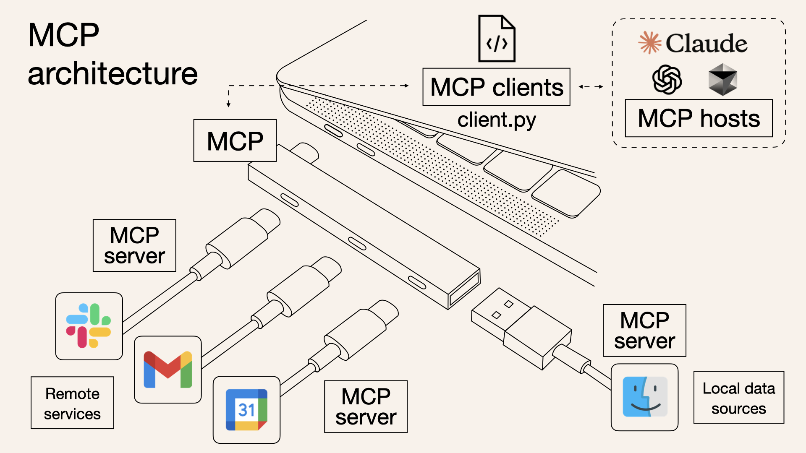
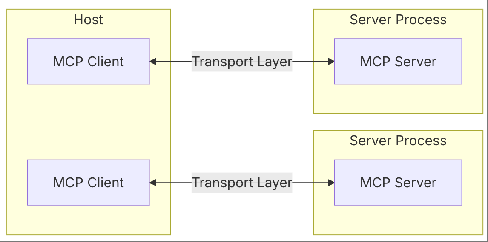
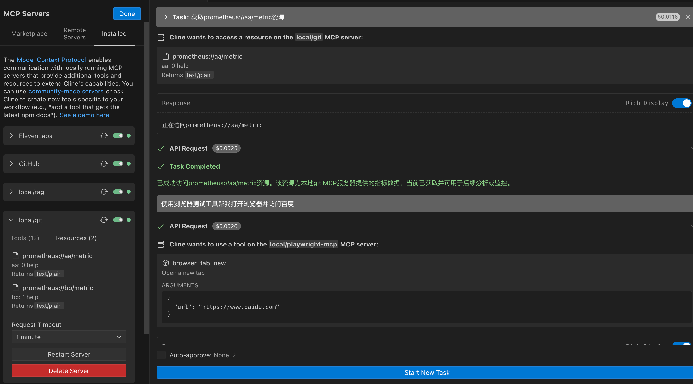

<h2 align="center">模型上下文协议（MCP）介绍</h2>

### 简介

MCP旨在为大型语言模型提供一种标准化的方式,以便它们能够与外部数据源和工具进行无缝集成   
通过MCP可以简化开发流程,任何遵守协议开发的工具可以轻松集成到各个LLM应用中

### 核心架构

    
    
`Host`：通过MCP发起连接的LLM应用程序,如Claude Desktop、IDE等            
`Client`：在`Host`应用程序内部与`Server`保持1:1连接,命令行交互模式中不再需要`Host`    
`Server`：通过MCP向`Client`提供工具、资源和提示词    
传输层: 处理`Client`和`Server`之间的通信,支持Stdio和SSE两种传输机制,所有传输均使用JSON-RPC 2.0交换消息     
说明:

1. Stdio传输速度非常快,基于标准输入/输出流进行通信,不支持跨网络访问,`Server`进程被`Client`进程作为子进程创建出来
2. SSE传输速度相对慢,基于HTTP,跨网络传输,可用于前端页面和公共服务

### 执行流程

1. `Client`从`Server`获取可用工具列表,资源列表,提示词列表描述信息发送给模型
2. `Client`将您的问题发送给模型
3. 模型分析可用的工具并决定使用哪些工具
4. `Client`通过`Server`执行所有请求的工具调用
5. 将结果发送回模型(非必须)
6. 模型生成自然语言响应并显示(非必须)

### `Server`功能介绍

- 工具: LLM可调用的函数（需经用户批准）
- 提示词: 用于引导模型生成或执行任务的预编写模板,在MCP协议中一般在工具调用时,作为输入参数传递给模型
- 资源: LLM可读取并用作交互上下文的数据,如日志、图片、代码、数据库表结构等

说明:

1. 当工具、提示词、资源列表有更新时,`Server`可以使用`notifications/{tools | prompts | resources}/list_changed`通知`Client`
2. 当资源内容频繁更新时,`Client`可以使用`resources/subscribe`订阅资源,`Server`
   在资源内容更新时发送`notifications/resources/updated`通知`Client`
3. ROOTS是由`Host`侧配置,传递给`Client`,用来限制`Server`可访问的资源范围

### `Server`核心代码

```python
import asyncio
from mcp.server import Server
from mcp.server.stdio import stdio_server
from mcp.types import TextContent, Tool, Resource, Prompt, GetPromptResult

server = Server("mcp-git")


@server.list_resources()  # 资源列表
async def list_resources() -> list[Resource]:
    pass


@server.read_resource()  # 获取资源
async def read_resource(uri) -> str | bytes:
    pass


@server.list_tools()  # 工具列表
async def list_tools() -> list[Tool]:
    pass


@server.call_tool()  # 调用工具逻辑
async def call_tool(name: str, arguments: dict) -> list[TextContent]:
    pass


@server.list_prompts()  # 提示词列表
async def handle_list_prompts() -> list[Prompt]:
    pass


@server.get_prompt()  # 获取词列表
async def handle_get_prompt(name: str, arguments: dict[str, str] | None) -> GetPromptResult:
    pass


async def main():
    options = server.create_initialization_options()
    async with stdio_server() as (read_stream, write_stream):  # 标准输入输出方式运行
        await server.run(read_stream, write_stream, options, raise_exceptions=True)


if __name__ == "__main__":
    asyncio.run(main())
```

### Debug

```shell
npx -y @modelcontextprotocol/inspector uv run main.py
# 直接在命令行执行即可
```

### 使用说明

